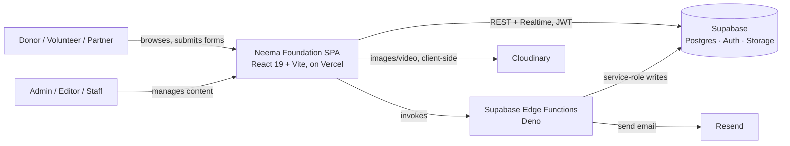
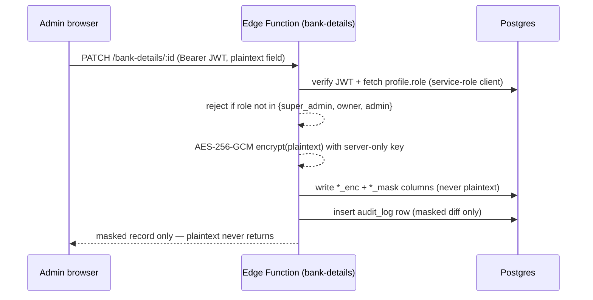

# Architecture

**Status:** Live
**Last updated:** 2026-08-29
**Owner:** Web Team (Engineering)

Companion docs: [PRD](PRD.md) · [DATABASE](DATABASE.md) · [RBAC](RBAC.md) · [Decision records](adr/)

---

## 1. System context

Neema Foundation Kilifi runs as a single Vite-built React SPA with two audiences
behind one router: an anonymous **public site** and an authenticated **admin
CMS**. There is no separate backend service — Supabase is the entire backend
(Postgres, Auth, Storage, and serverless Edge Functions), reached directly from
the browser. Two third-party services sit outside Supabase: **Cloudinary**
(image/video hosting and transformation) and **Resend** (transactional email,
invoked from an Edge Function).

## 2. Containers

| Container | Tech | Responsibility |
|---|---|---|
| **Public site** | React 19, React Router 7, Tailwind, Framer Motion | Marketing/impact content, donation pathways, forms. No auth required. |
| **Admin CMS** (`/admin/*`) | Same SPA, code-split via `React.lazy` | Role-gated content, media, events, users, bank-details, and maintenance management. |
| **Supabase Postgres** | Postgres + Row Level Security | System of record for all content and transactional data. |
| **Supabase Auth** | GoTrue, PKCE flow | Admin authentication only — the public site never authenticates. |
| **Supabase Edge Functions** (Deno) | `bank-details`, `send-notification`, `send-reply`, `invite-user`, `maintenance-notify`, `check-maintenance-schedule` | Anything that needs the service-role key or a server-side secret: encryption, outbound email, privileged writes. |
| **Cloudinary** | External | All media storage/delivery — the app never stores binary assets itself. |
| **Vercel** | Static hosting + CDN | Builds and serves the SPA; env vars injected at build time (`VITE_*`). |

There is deliberately **no custom backend server** — the boundary the team drew
is "browser talks to Supabase directly for everything RLS can safely gate, and
drops into an Edge Function only for the handful of operations RLS can't
express" (encryption, email, privileged role assignment). See
[ADR-0001](adr/0001-supabase-as-the-only-backend.md).

## 3. Two Supabase clients, one purpose: keep the public site auth-free

[`src/lib/supabase/client.ts`](../src/lib/supabase/client.ts) exports **two**
client instances instead of one:

- `supabasePublic` — `persistSession: false`, `autoRefreshToken: false`. Used
  by every public-facing hook in `src/hooks/public/`.
- `supabaseAdmin` — full session persistence, PKCE flow, its own
  `storageKey`. Used only inside `src/admin/**`, which is entirely lazy-loaded.

This split exists to fix a specific, previously-real bug class: a single
shared client with `persistSession: true` was causing `AbortError`s on public
pages from Supabase's cross-tab auth lock, even for visitors who were never
logging in. See [ADR-0002](adr/0002-split-public-and-admin-supabase-clients.md).

## 4. Routing & code-splitting

`src/App.tsx` defines two route trees under one `<Routes>`:

- `/admin/*` — wrapped in `AdminShell` (scopes `AuthProvider` to this subtree
  only), then `AuthGuard`, then `AdminLayout`. Every admin page component is
  wrapped in [`lazyWithRetry`](../src/lib/lazyWithRetry.ts) rather than plain
  `React.lazy` — a home-grown fix for stale-chunk `ChunkLoadError`s after a
  Vercel deploy: on a chunk-load failure it does one cache-busted hard reload
  (rate-limited via `sessionStorage` to avoid a reload loop) instead of
  showing a broken error boundary.
- `/*` — public routes, wrapped in `MaintenanceErrorBoundary` →
  `MaintenanceProvider` → `Navbar` / page / `Footer`.

Public pages are **not** lazy-loaded — they're the initial bundle, sized to
the PRD's ≤180KB JS budget; only the admin CMS and its heavier dependencies
(Tiptap, dnd-kit, the maintenance rule builder) are deferred.

## 5. Data fetching & caching

TanStack Query, one shared `queryClient` ([`admin/config/queryClient.ts`](../src/admin/config/queryClient.ts)):
5 min `staleTime`, 10 min `gcTime`, refetch on window focus/reconnect, retry
once. All query keys are centralized in a `queryKeys` object rather than
inlined per-hook — new hooks are expected to register their key there rather
than hand-roll one.

Two data-access shapes exist side by side:

- **Public reads** (`src/hooks/public/*`) — direct `supabasePublic` queries
  against public views/RLS-gated `SELECT`s, no mutations.
- **Admin CRUD** (`src/admin/hooks/*`) — most tables are read/written directly
  via `supabaseAdmin` under RLS; the one exception is bank details, which
  never writes to Postgres directly from the browser (§6).

Representative pattern (from `useBankDetailsAdmin`, and mirrored by the other
admin hooks): an `AbortController` cancelled on unmount, retry with
exponential backoff on 5xx/network errors (not on 4xx), optimistic local
updates with rollback on failure, and a `sonner` toast on every outcome.

## 6. Sensitive-data write path (bank details)

The one place the browser is never allowed to write Postgres directly:

Full model in [ADR-0003](adr/0003-encrypt-bank-details-via-edge-function.md).

## 7. Deployment topology

Vercel, framework auto-detected as Vite. `vercel.json` does two things: an
SPA catch-all rewrite (`/(.*) → /`) and three security headers
(`X-Content-Type-Options`, `X-Frame-Options: DENY`,
`Referrer-Policy: strict-origin-when-cross-origin`) on every route. Preview
deployments are created automatically per PR. All Supabase/Cloudinary
credentials are `VITE_*` env vars injected at build time — see `.env.example`
for the full list and [SECURITY.md](SECURITY.md) for what's expected to never
be committed.

## 8. Known issues / technical debt

Documented here deliberately, not swept under a "future roadmap" — an
architecture doc that only describes the happy path isn't trustworthy.

- **Two schema tracks.** `supabase-schema.sql` (repo root) and
  `supabase/migrations/*.sql` (Supabase-CLI-managed, timestamped) both exist,
  plus a third, older `migrations/*.sql` folder of hand-run, non-timestamped
  scripts (per `DATABASE-SETUP-REQUIRED.md`, applied manually via the
  dashboard SQL editor). The root schema file's `role` check constraint
  (`super_admin/admin/editor/viewer`) is stale — actual code
  (`admin/types/roles.ts`, the `bank-details` Edge Function) uses the six-role
  set added by `migrations/phase8-role-based-access-control.sql`
  (`super_admin/owner/admin/events_manager/content_manager/viewer`). Treat
  `supabase/migrations/` as authoritative going forward; see
  [DATABASE.md](DATABASE.md#migration-history) for the reconciled schema.
- **Design tokens defined but not consistently used.** `tailwind.config.js`
  defines `neema-maroon` brand colors, but many components (`Navbar.tsx`,
  `ConfirmDialog.tsx`) use Tailwind's default `red-800`/`red-600` palette
  instead, while others (`Hero.tsx`) hardcode raw hex (`#B01C2E`) rather than
  either token system. Three different ways to say the same brand color.
  Detailed in [DESIGN-MASTER-PLAN.md](DESIGN-MASTER-PLAN.md).
- **`src/index.css` still carries the unmodified Vite starter template**
  (dark `#242424` background, `#646cff` link color) alongside the real
  iOS-inspired admin design system added later. None of the starter rules are
  reachable in the shipped UI, but they cost a reviewer real time to rule out.
- **God components.** `src/components/Hero.tsx` (~1,390 lines) combines a
  full custom video player (state machine, analytics, double-tap seek, quality
  switching), a canvas particle background, and hero markup in one file, with
  an inline `<style>` tag. It's the largest single-responsibility violation in
  the codebase and the best current candidate for a decomposition pass.
- **Naming collisions.** `src/components/Programs.tsx` and
  `src/components/programs/Programs.tsx` both exist; imports rely on the
  barrel export (`components/programs/index.ts`) to disambiguate on
  case-sensitive filesystems, per the comment in `App.tsx`. Confusing for
  anyone grepping by filename.
- **A `.legacy.ts` file is still imported.** `useHeroContent.legacy.ts` sits
  next to `useHeroContent.ts` with no doc comment explaining which callers
  still depend on the legacy version or a removal plan.
- **Scattered `as any` casts** around Supabase queries (e.g.
  `useBankDetailsAdmin.fetchAudit`) bypass the generated `Database` types from
  `src/lib/supabase/types.ts` in exactly the places type safety would catch a
  column-name typo.
