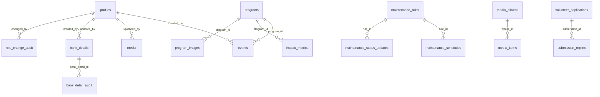

# Database

**Status:** Live
**Last updated:** 2026-08-29

Referenced from [PRD.md](PRD.md). See [ARCHITECTURE.md](ARCHITECTURE.md#8-known-issues--technical-debt) for why this doc exists in the first place — the schema is spread across three sources that don't fully agree.

---

## Migration history

Three sources define the schema, applied in this order on a fresh project:

1. **`supabase-schema.sql`** (repo root) — the original 12-table foundation:
   `profiles`, `programs`, `events`, `impact_metrics`, `stories`,
   `board_members`, `site_settings`, `hero_content`, `trust_bar_items`,
   `submissions`, `media`, `audit_log`. Run manually via the Supabase
   dashboard SQL editor (see `DATABASE-SETUP-REQUIRED.md`).
   **Its `profiles.role` constraint is stale** — superseded by #2.
2. **`migrations/*.sql`** (repo root, ~30 files, hand-run, not
   timestamp-ordered by filename) — everything added after the foundation:
   bank details, the maintenance system, media albums (moved into their own
   `media` schema), partners, volunteer applications, onboarding tracking,
   submission replies, program images, and Phase 8's RBAC upgrade. Apply in
   the dependency order implied by each file's own header comment, not
   filename alphabetical order.
3. **`supabase/migrations/*.sql`** (Supabase-CLI-managed, timestamped,
   `supabase db push`) — the newest work, starting after this track was
   adopted. Currently 4 files, one of which
   (`20260306120000_add_maintenance_templates.sql`) re-declares
   `maintenance_templates` already created by the older
   `migrations/add-maintenance-templates.sql` — treat the timestamped copy as
   the current version going forward.

**For a new environment:** run `supabase-schema.sql` first, then every file in
`migrations/` in dependency order, then everything in `supabase/migrations/`.
For an existing environment, only ever apply what hasn't been applied yet —
several files use `CREATE TABLE IF NOT EXISTS` / `ADD COLUMN IF NOT EXISTS`
defensively, so re-running is mostly safe, but the two `profiles.role`
constraint definitions are not compatible (see [RBAC.md §5](RBAC.md#5-known-inconsistency)).

## Entity overview

(Simplified — see each table's own migration file for full FK constraints.
`bank_detail_audit.bank_detail_id` is `ON DELETE SET NULL`, deliberately, so
the audit trail survives a hard delete.)

## Tables by domain

Every table has RLS enabled; the general pattern throughout is *public SELECT
on a "published/active" flag, authenticated-role SELECT on everything, and
role-gated INSERT/UPDATE/DELETE via an `EXISTS (SELECT 1 FROM profiles
WHERE id = auth.uid() AND role IN (...))` subquery* — see
[RBAC.md](RBAC.md) for exactly which roles gate which action, so it isn't
repeated per-table here.

### Identity & access

| Table | Purpose |
|---|---|
| `profiles` | Extends `auth.users`. `role`, `is_active`, `last_login_at/ip`, `phone_number`, `organization`. |
| `user_activity_log` | General activity audit trail — action, resource, IP, user agent. |
| `role_change_audit` | Append-only log of every role change, via `update_user_role()`. |

### Content

| Table | Purpose |
|---|---|
| `programs` | Foundation programs — category, objectives/activities arrays, beneficiary info, featured flag. |
| `program_images` | Per-program gallery images (Cloudinary-backed), bridged into the unified `media` schema by `bridge-program-images-to-media.sql`. |
| `stories` | Testimonials/news/impact stories — `category`, `is_featured`, `is_published`, `display_order`. |
| `board_members` | Team/board profiles — name, title, bio, photo, social. |
| `hero_content` | Homepage hero carousel slides. |
| `trust_bar_items` | Partner-logo trust bar entries. |
| `impact_metrics` | Homepage impact counters — `value`, `unit`, `year`, optional `program_id`. |
| `partners` | Partner organizations shown on the public site. |
| `site_settings` | Singleton (`id = 'main'`) — brand name, tagline, mission/vision/values, social links, primary/secondary color. |

### Media (own Postgres schema: `media`)

| Table | Purpose |
|---|---|
| `media.media_albums` | Photo/video album grouping (event albums, program albums, general). |
| `media.media_items` | Individual media assets within an album. |

Moved out of `public` into a dedicated `media` schema by
`move-media-to-media-schema.sql` — public read access is exposed through
views created in `create-public-media-views.sql` / `expose-media-schema.sql`,
not by granting direct schema access to the anon role.

### Events & submissions

| Table | Purpose |
|---|---|
| `events` | Event listings — dates, venue/virtual, registration, `status` lifecycle (`draft→published→cancelled/completed/archived`), optional `program_id`. |
| `submissions` | Generic form intake — `type` (`contact/volunteer/partnership/donation/sponsorship/event`), `status` (`new→in_progress→responded→closed`), free-form `metadata` JSONB. |
| `volunteer_applications` | Dedicated volunteer application records (richer than generic `submissions`), with its own status lifecycle referenced in [ARCHITECTURE.md](ARCHITECTURE.md) and the PRD. |
| `submission_replies` | Threaded replies to a submission, joined to `volunteer_applications`/`submissions` for the admin reply UI. |

### Bank details (see [ADR-0003](adr/0003-encrypt-bank-details-via-edge-function.md) for the full model)

| Table / view | Purpose |
|---|---|
| `bank_details` | Payment method records. Sensitive fields stored only as `*_enc` (AES-256-GCM ciphertext) + `*_mask` (display string) pairs — never plaintext. |
| `bank_detail_audit` | Append-only, field-level diff audit log. `bank_detail_id` is nullable (`ON DELETE SET NULL`) so history survives a hard delete. |
| `bank_details_public` (view) | Strips every `*_enc` column — the only thing the anonymous `/bank-details` page ever queries. |

### Maintenance system

| Table | Purpose |
|---|---|
| `maintenance_rules` | Core rule: `scope` (`global/page/section/component/feature_group`), `target_key`, `severity` (`full_block/degraded/notice`), `estimated_end`, `display_config` JSONB. See [ARCHITECTURE.md](ARCHITECTURE.md) and `src/__tests__/maintenance/rule-evaluation.test.ts` for the matching algorithm this drives. |
| `maintenance_schedules` | Planned maintenance windows tied to a rule. |
| `maintenance_status_updates` | Live status posts shown on the public maintenance banner/page (has `REPLICA IDENTITY FULL` for Realtime). |
| `maintenance_audit_log` | Change history for rules themselves. |
| `maintenance_notifications` | Notification dispatch records, consumed by the `maintenance-notify` Edge Function. |
| `maintenance_templates` | Reusable rule presets (latest definition lives in `supabase/migrations/`, see Migration history above). |

### Onboarding

| Table | Purpose |
|---|---|
| `onboarding_progress` | Per-admin-user tour/checklist completion state, consumed by `useOnboardingProgress` / `useOnboardingTracker`. |

## Functions & triggers worth knowing about

- `handle_new_user()` — auto-creates a `profiles` row (`role = 'viewer'`) on
  every new `auth.users` signup.
- `handle_updated_at()` / `set_updated_at()` — generic `updated_at` bump,
  attached per-table (two differently-named but functionally identical
  versions exist — the base schema's and the bank-details migration's).
- `update_user_role(target_user_id, new_role, reason)` — `SECURITY DEFINER`;
  the only sanctioned path to change a role (§ [RBAC.md](RBAC.md#4-role-management)).
- `log_user_activity(action, resource_type, resource_id, details)` —
  `SECURITY DEFINER` helper any authenticated flow can call to append to
  `user_activity_log`.

## Environment / secrets this schema depends on

Not part of the schema itself but required for it to function — see
`.env.example` and [SECURITY.md](SECURITY.md):

- `VITE_SUPABASE_URL`, `VITE_SUPABASE_ANON_KEY` — browser-side, public by
  design (RLS is the actual gate).
- `SUPABASE_SERVICE_ROLE_KEY` — Edge Function secret only, never shipped to
  the browser.
- `BANK_DETAILS_ENCRYPTION_KEY` — Edge Function secret only; a 64-char hex
  string (`openssl rand -hex 32`). Losing this key makes existing encrypted
  bank fields permanently unrecoverable — back it up outside the repo.
